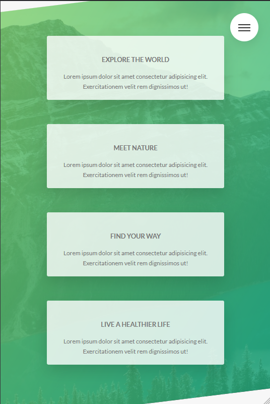

# Natours

Natours is a site designed to show the various possible tours that a user can sign up for.

## ℹ️ Basic goal

The main goal of the website is to learn positioning and animation using SASS, structuring project files and using PostCSS.


## 🎬 Animation and positioning

By using tools such as keyframes, transform and video background, simple but smooth animations were achieved.


## 🎫 Form

There was also space to create a form that can be found on most modern websites.


## 📃 Animated menu


## 📏 Responsiveness

The application is fully responsive and adapts to the current resolution of your screen.





## Run Locally

Make sure you have Node and npm installed (https://nodejs.org/en)

Clone the project

```bash
  git clone https://github.com/dosmiko7/Natours
```

Go to the project directory

```bash
  cd Natours
```

Install dependencies

```bash
  npm install
```

Start the server

```bash
  npm run start
```

## Demo

https://natours-mo.netlify.app/

## Tech Stack

- Node v18.14.2
- npm v9.5.0
- SCSS,
- HTML,
- PostCSS
